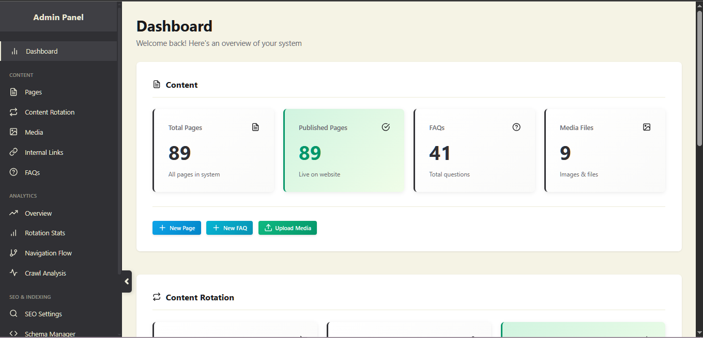

# CustomSEOfocusedCMS

SEO-focused CMS with monthly content rotation, bilingual pages (RU/UZ), media library, and built-in analytics.

## Features
- Content pages with month-based rotations
- Per-page SEO metadata + JSON-LD
- Sitemap + robots.txt
- Analytics (page views, navigation flow, rotation stats)
- Media manager and FAQ support

## Quick Start
1. Create a MySQL database and import `database/schema.sql`.
2. Set DB credentials in `config/database.php`.
3. Set `BASE_URL` in `config/config.php`.
4. Ensure write permissions for `public/uploads` and `logs`.

## Admin
- URL: `/admin`
- Create an admin user in the `users` table (password stored as a hash).

## Requirements
- PHP 7.4+
- MySQL 5.7+ or MariaDB 10.3+
- Apache with `mod_rewrite`
