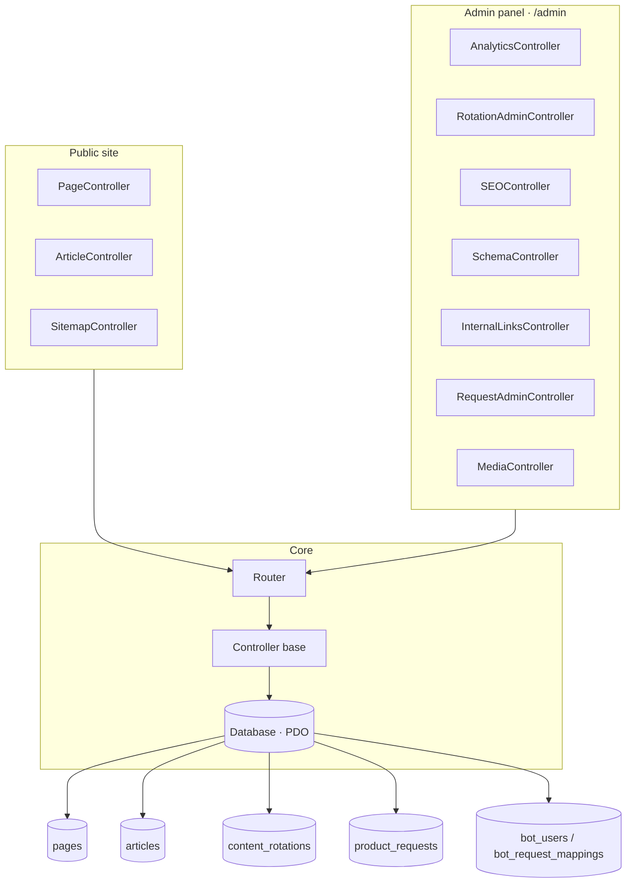
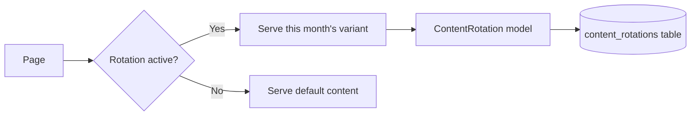
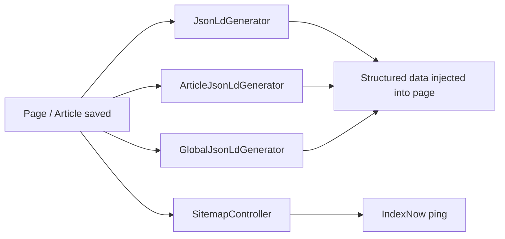
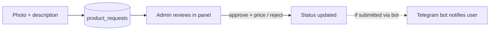

# CustomSEOfocusedCMS

Custom PHP MVC · No framework · Built solo

## What's in here

| Module | Controllers | Models |
|---|---|---|
| Content | Article, Page | `Article`, `Page`, `ContentRotation` |
| SEO | SEO, Schema, Sitemap | `JsonLdGenerator`, `ArticleJsonLdGenerator`, `GlobalJsonLdGenerator`, `IndexNow` |
| Analytics | Analytics | `Analytics` |
| Links | InternalLinks, LinkWidget | `LinkWidget` |
| Media | Media | `Media`, `PageMedia` |
| Buyback | RequestAdmin, Bot | `ProductRequest`, `ProductRequestImage`, `BotUser`, `BotRequestMapping` |
| FAQ | FAQAdmin | `FAQ` |

14 admin controllers total — each scoped to one concern, no god-controller.

## Architecture

```mermaid
flowchart TB
    subgraph Public["Public site"]
        PageC[PageController]
        ArticleC[ArticleController]
        SitemapC[SitemapController]
    end

    subgraph Admin["Admin panel · /admin"]
        Analytics[AnalyticsController]
        Rotation[RotationAdminController]
        SEOc[SEOController]
        Schema[SchemaController]
        Links[InternalLinksController]
        Requests[RequestAdminController]
        Media[MediaController]
    end

    subgraph Core
        Router[Router] --> Controller[Controller base]
        Controller --> DB[(Database · PDO)]
    end

    Public --> Router
    Admin --> Router

    DB --> Pages[(pages)]
    DB --> Articles[(articles)]
    DB --> Rotations[(content_rotations)]
    DB --> Requests2[(product_requests)]
    DB --> BotTables[(bot_users / bot_request_mappings)]
```

## Content rotation

The thing this CMS is actually built around: a page isn't one fixed piece of content, it's a schedule.

```mermaid
flowchart LR
    A[Page] --> B{Rotation active?}
    B -->|Yes| C[Serve this month's variant]
    B -->|No| D[Serve default content]
    C --> E[ContentRotation model]
    E --> F[(content_rotations table)]
```

## SEO pipeline

```mermaid
flowchart LR
    P[Page / Article saved] --> J1[JsonLdGenerator]
    P --> J2[ArticleJsonLdGenerator]
    P --> J3[GlobalJsonLdGenerator]
    J1 & J2 & J3 --> Out[Structured data injected into page]
    P --> SM[SitemapController]
    SM --> IN[IndexNow ping]
```

## Buyback request review

A second system layered on top — users submit photos for buyback, admins price them. Telegram intake is optional and lives in its own repo section.

```mermaid
flowchart LR
    U[Photo + description] --> PR[(product_requests)]
    PR --> Admin[Admin reviews in panel]
    Admin -->|approve + price / reject| Done[Status updated]
    Done -.->|if submitted via bot| BotNotify[Telegram bot notifies user]
```

→ Full bot writeup: [`telegram_bot/README.md`](telegram_bot/README.md)

## Stack

PHP 7.4+ · MySQL · vanilla JS/CSS · Apache + `mod_rewrite` · zero framework dependency
