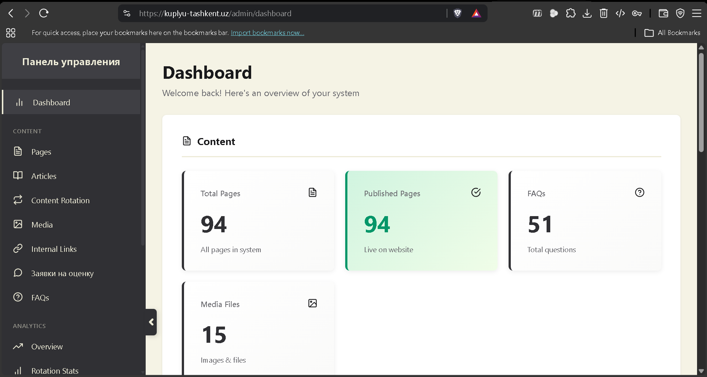
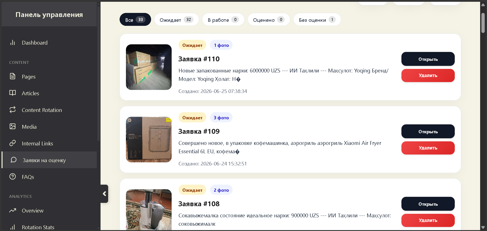
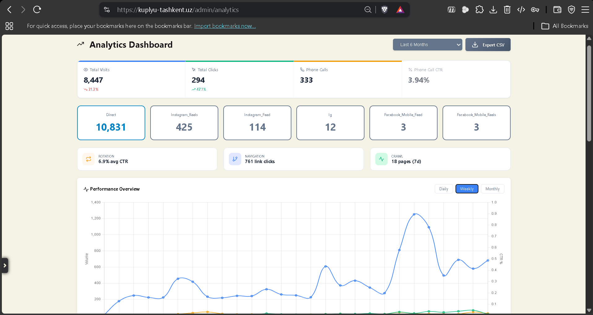
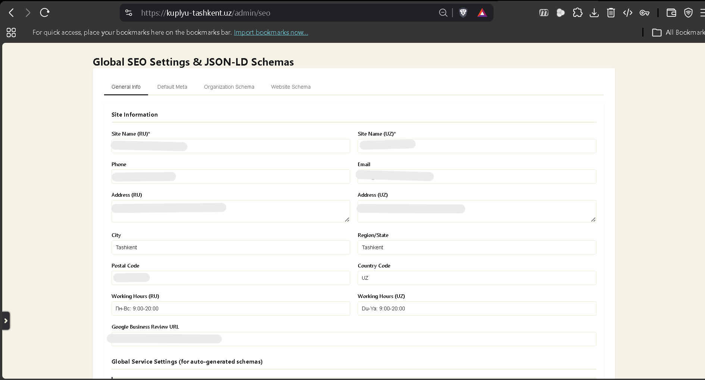

<div align="center">

# CustomSEOfocusedCMS

**Custom PHP MVC CMS with a built-in SEO engine — content rotation, internal link graph, JSON-LD generation, and crawl analytics — powering [kuplyu-tashkent.uz](https://kuplyu-tashkent.uz)**

[](https://kuplyu-tashkent.uz)
[](#architecture)
[](#seo-engine)
[](https://kuplyu-tashkent.uz)

</div>

---

## What this is

A self-built CMS — no framework — for running an SEO-driven landing/content site and operating the back-office for a Telegram-based buying business on top of it. The public site looks like a simple set of landing pages. Behind it is a full admin system handling content rotation, internal linking, structured data, crawl monitoring, and operator workflows for incoming product requests.

Built from a custom `Router` → `Controller` → `Model` core, no Laravel/Symfony underneath.

## Screenshots

<table>
<tr>
<td width="50%">

**Dashboard**
<br>


</td>
<td width="50%">

**Request Review** <sub>(swipe-to-navigate lightbox)</sub>
<br>


</td>
</tr>
<tr>
<td width="50%">

**Analytics**
<br>


</td>
<td width="50%">

**SEO settings**
<br>


</td>
</tr>
</table>

## Architecture

```
Browser ──▶ public/index.php ──▶ core/Router ──▶ Controller ──▶ Model ──▶ core/Database
                                       │
                                       ├── Admin namespace (auth-gated, 13 controllers)
                                       └── Public namespace (Article / Page / Sitemap / Bot)
```

| Layer | Responsibility |
|---|---|
| `core/Router.php` | Maps requests to controllers, no external routing lib |
| `core/Controller.php` | Base controller, shared request/response handling |
| `core/Database.php` | DB access layer |
| `config/security.php` | Auth, session, request hardening |
| `controllers/admin/*` | 13 controllers, one per admin domain (below) |
| `models/*` | 19 models — content, SEO, bot-bridge, JSON-LD generators |
| `views/admin/*` | Server-rendered PHP views, modular per-page CSS/JS |

No ORM, no template engine dependency — views are plain PHP with a shared `header.php` / `footer.php` layout.

## Admin modules

| Module | Controller | What it does |
|---|---|---|
| Dashboard | `DashboardController` | Operational overview |
| Product Requests | `RequestAdminController` | Review queue for incoming Telegram bot submissions |
| Content Rotation | `RotationAdminController` | Scheduled rotation of homepage/landing content blocks |
| Internal Links | `InternalLinksController`, `LinkWidgetController` | Internal link graph management + on-site widget injection |
| Analytics | `AnalyticsController` | Crawl behavior, navigation paths, per-page stats |
| SEO Settings | `SEOController` | Sitemap config, IndexNow submission, meta control |
| Schema / JSON-LD | `SchemaController` | Structured data per article/page (`ArticleJsonLdGenerator`, `GlobalJsonLdGenerator`) |
| Articles & Pages | `ArticleAdminController`, `PageAdminController` | Content CRUD |
| FAQ | `FAQAdminController` | FAQ schema-linked content |
| Media | `MediaController` | Asset management |
| Preview | `PreviewController` | Draft preview before publish |
| Auth | `AuthController` | Admin session/login |

## SEO engine

This is the part that isn't typical CMS boilerplate:

- **JSON-LD generation** — `ArticleJsonLdGenerator` + `GlobalJsonLdGenerator` build structured data per content type, not a static template
- **Internal link graph** — `InternalLinksController` + `LinkWidget` model manage and inject contextual internal links sitewide, trackable via `link-tracking.js`
- **Content rotation engine** — `ContentRotation` model + `RotationAdminController` rotate featured/landing content on a schedule rather than serving it static
- **IndexNow integration** — `IndexNow` model pushes updated URLs for fast re-indexing instead of waiting on crawl cycles
- **Crawl analytics** — `Analytics` model + dedicated `crawl.php` view track how search engines actually traverse the site

## Bot integration

`BotController` + `BotRequestMapping` + `RequestAccessToken` bridge this CMS to the Telegram-side product intake bot — HMAC-authenticated, token-scoped access per request rather than shared admin credentials.

**Sub-project:** [ReviewRequestBot →](#) — the Python/FastAPI bot, pricer microservice, and GPT-4o-mini vision pipeline that feeds requests into this admin panel.

## Stack

`PHP 8` · `Custom MVC` (no framework) · `MySQL` · `Vanilla JS` (`feather.min.js`, modular per-feature JS) · `Custom CSS` (componentized: `core/`, `components/`, per-module)

## Live

🔗 **[kuplyu-tashkent.uz](https://kuplyu-tashkent.uz)** — public-facing site. The CMS and SEO tooling above run entirely behind it.
